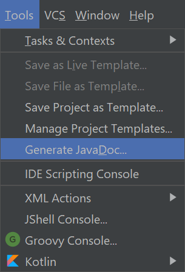

# JJDDR1 - Zadanie domowe nr. 1
## Cel

Stowrzyłem klasę SomeRandomCardGame, w której zawarta jest logika dla prostej gry karcianej.
Twoim zadaniem jest napisać implementację dla klasy Card oraz utworzyć klasy dla talii kart i komparatora kart, które pozwolą na prawidłowe funkcjonowanie logiki gry.

Rozwiązanie należy przesłać do czwartku, 17 września, do godziny 23:59, na mój adres mailowy: [tomasz.odwald@gmail.com](mailto:tomasz.odwald@gmail.com?subject=Praca%20domowa%201%20-%20imie%20nazwisko)

## Zadania
#### Card
Dla osób mniej obeznanych ze standardową talią kart - [Wikipedia](https://en.wikipedia.org/wiki/Standard_52-card_deck)

##### 1. Stwórz pola rank (wartość karty) i suit (kolor) z odpowiednim typem i modyfikatorem dostępu (3 pkt.)
Rank to np.: Ace, 2, 3, ..., Queen, King

Suit to: Hearts, Diamonds, Clubs, Spades

##### 2. Napisz implementację dla metody *toString()* (2 pkt.)
Przykładowe wyniki wywołania metody: "*Ace of Spades*", "*7 of Clubs*"

##### 3. Napisz implementację dla metod *equals()* i *hashCode()* (2 pkt.)

#### StandardDeck
##### 1. Stwórz klasę *StandarDeck*, która dziedziczy po klasie *Deck* (1 pkt.)

##### 2. Stwórz kolekcję do przechowywania kart (2 pkt.)

##### 3. Napisz implementację dla metod z klasy *Deck* korzystając z kolekcji z punktu 2. (5 pkt.)

#### CardComparator
##### 1. Stwórz klasę *CardComparator* implementujący interfejs *Comparator* dla obiektów typu *Card* (1 pkt.)

##### 2. Napisz implementację metody *compare()* (2 pkt.)
Najpierw sprwadź rank: Ace > King > Queen > Jack > 10 > 9 > ... > 2.

Jeśli rank jest równy, to sprawdź suit: Hearts > Diamonds > Clubs > Spades.

#### Homeworks.main()
##### 1. Stwórz obiekty dla klas *StandardDeck* i *CardComparator* i przekaż je do konstruktora *SomeRandomCardGame* (1 pkt.)

#### JavaDoc
##### 1. Napisz komentarze do klasy Card (2 pkt.)
Jako przykład może Ci posłużyć klasa Deck.

##### 2. Wygeneruj JavaDoc dla projektu i zapisz je w katalogu */javadocs* (1 pkt.)

#### Punktacja ogólna
##### 1. Zachowanie konwencji nazewnictwa klas, metod i zmiennych (2 pkt.)
##### 3. Zachowanie konwencji stylistycznej kodu (2 pkt.)
##### 4. Ogólna ocena kodu pod względem wydajności i zastosowanych typów zmiennych (4 pkt.)

## Dodatkowe - dla chętnych
##### 1. Stwórz klasę *JokerCard*, która zawsze wygrywa.
##### 2. Dodaj logikę dla remisów.
##### 3. Dodaj obsługę błędów - nie pozwól na wykonanie metody *startGame()*, gdy w konstruktorze przekażemy jakiś parametr *null*.